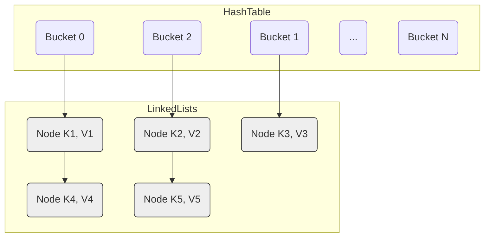
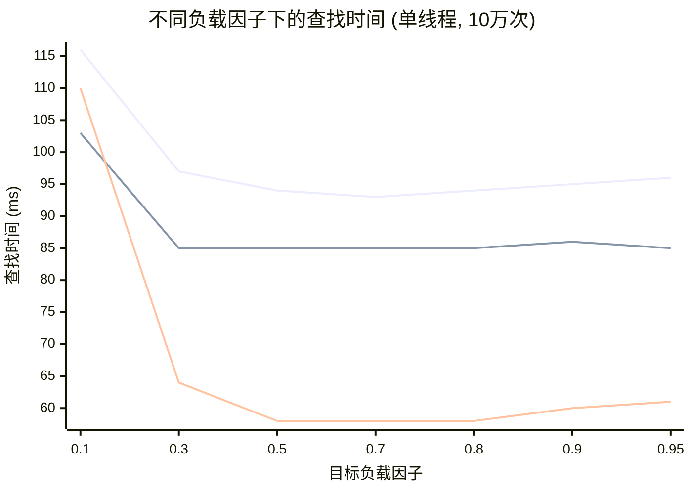

# 现代哈希表 vs. 传统哈希表：深入 Boost.Unordered 的 Flat 与 Concurrent 实现

## 引言

哈希表（Hash Table）是计算机科学中最基础和实用的数据结构之一，提供了平均 O(1) 时间复杂度的插入、查找和删除操作。C++ 标准库中的 `std::unordered_map` 和 `std::unordered_set` 是最常用的哈希表实现。随着硬件架构的发展和性能优化的需求，现代哈希表设计已经远超传统实现。

Boost.Unordered 库提供了多种哈希容器实现，包括对标准接口的优化版本 (`boost::unordered_map`) 以及基于现代设计的高性能变体，如 `boost::unordered_flat_map` 和 `boost::concurrent_flat_map`。本文将分析传统哈希表与这些现代哈希表在实现机制、性能特性和并发处理上的差异。

参考资料：[Inside boost::unordered_flat_map](https://bannalia.blogspot.com/2022/11/inside-boostunorderedflatmap.html)

## 1. 传统哈希表：分离链表法 (Separate Chaining)

大多数 C++ 标准库的 `std::unordered_map` 以及 `boost::unordered_map` 采用的是**分离链表法**（也称拉链法）。

### 1.1 工作机制

*   **桶数组 (Bucket Array)**: 内部维护一个指针数组，每个指针称为一个"桶"。
*   **哈希映射**: 元素的键通过哈希函数计算得到一个哈希值，该哈希值再通过取模等方式映射到桶数组的一个索引上。
*   **冲突处理**: 如果多个元素的键哈希到同一个桶索引（发生冲突），则这些元素会被存储在一个**链表**中，桶数组的对应位置存储指向该链表头节点的指针。
*   **查找**: 先定位到桶，然后遍历桶对应的链表，逐个比较键值，直到找到目标元素或遍历完链表。

### 1.2 优缺点

**优点:**

*   **实现相对简单**: 冲突处理逻辑清晰。
*   **删除简单**: 只需在链表中删除节点。
*   **指针/引用稳定性 (节点层面)**: 只要元素不被删除，存储元素的**节点**地址通常是稳定的（除非节点实现方式特殊），指向元素的指针（如果用户存储了指向节点的指针）不会因其他元素的插入/删除或 Rehashing 而失效。*注意：标准接口保证迭代器在 Rehashing 后失效，但不保证指向元素的指针/引用一定稳定。*
*   **对高负载因子不敏感**: 即使负载因子（元素数量/桶数量）超过 1，性能下降也相对平缓（链表变长）。

**缺点:**

*   **缓存效率低**: 访问元素需要至少两次内存跳转（桶数组 -> 链表节点 -> 元素数据），链表节点的内存通常不连续，容易导致 CPU 缓存未命中 (Cache Miss)。
*   **内存分配开销**: 每个元素都需要一个额外的链表节点，带来额外的内存分配/释放开销和内存碎片。
*   **性能瓶颈**: 内存访问延迟通常是现代 CPU 上的主要性能瓶颈，分离链表法的多次间接访问限制了其性能上限。

## 2. 现代哈希表：开放寻址 (Open Addressing) 与 `boost::unordered_flat_map`

为了克服分离链表法的性能瓶颈，现代高性能哈希表（如 Google 的 Swiss Table, `boost::unordered_flat_map`）普遍采用**开放寻址**技术。

### 2.1 工作机制

*   **单一数组**: 所有元素直接存储在哈希表的主数组中，无需额外的节点或链表。
*   **冲突处理 - 探测 (Probing)**: 当插入元素时，如果其哈希值对应的槽位已被占用，则按照预定的**探测序列**检查数组中的下一个槽位，直到找到空槽（`Empty`）或标记为已删除（`Deleted`）的槽位。
*   **常见的探测策略**:
    *   **线性探测 (Linear Probing)**: 检查 `i`, `i+1`, `i+2`, ... 实现简单但易产生聚集 (Clustering)。
    *   **二次探测 (Quadratic Probing)**: 检查 `i`, `i+1²`, `i+2²`, ... （或类似变体）可以减轻聚集。`boost::unordered_flat_map` 采用此类策略。
    *   **双重哈希 (Double Hashing)**: 使用第二个哈希函数确定探测步长。

### 2.2 关键优化：SIMD 加速与元数据 (受 Swiss Table 启发)

`boost::unordered_flat_map` 的设计受 Google Swiss Table 启发，其高性能关键在于：

*   **元数据数组**: 除了主数组外，还维护一个紧凑的**控制字节数组**，每个控制字节（1 byte）对应主数组的一个槽位。
*   **控制字节编码**:
    *   **状态位**: 控制字节的高位标记槽位状态：`Empty`、`Deleted`、`Full`。特殊值如 `Sentinel` 可用于标记数组末尾。
    *   **哈希片段 (h2)**: 控制字节的低位（通常 7 位）存储元素原始哈希值的一部分。
*   **SIMD 加速查找**:
    1.  计算待查键的哈希值 `h`，得到两部分：`h1` 用于定位初始组，`h2` 是 7 位哈希片段。
    2.  **并行匹配**: 使用 SIMD 指令（如 SSE2 的 `_mm_cmpeq_epi8`, `_mm_movemask_epi8`）同时将目标 `h2` 与组内所有控制字节的哈希片段比较。
    3.  **快速过滤**: SIMD 指令返回位掩码，指示哪些槽位的 `h2` 匹配。结合状态位，可快速过滤掉不匹配的槽位。
    4.  **精确比较**: 只有当 `h2` 匹配且槽位为 `Full` 时，才访问主数组中对应元素，进行完整键比较。
*   **缓存友好**: 这种设计减少了内存访问次数，大多数不匹配槽位仅通过访问控制字节数组就被排除，大幅降低主数组访问频率。控制字节和主数组的连续存储提高了缓存局部性。

(图片来源: [bannalia.blogspot.com](https://bannalia.blogspot.com/2022/11/inside-boostunorderedflatmap.html))

### 2.3 删除与墓碑 (Tombstones)

在开放寻址中，不能简单地将被删除元素的槽位设为 `Empty`，因为这会中断探测链，导致后续查找失败。解决方法是使用**墓碑 (Tombstone)**：

*   将被删除元素的槽位标记为 `Deleted` 状态（通过控制字节）。
*   查找操作遇到 `Deleted` 槽位时会继续探测。
*   插入操作可以将新元素放入 `Deleted` 槽位，从而回收空间。

### 2.4 Rehashing

当负载因子（`size / capacity`）达到某个阈值（例如 7/8）时，为了维持性能，需要进行 Rehashing：

*   分配一个更大的新数组（主数组 + 控制字节数组）。
*   遍历旧数组中的所有 `Full` 元素。
*   重新计算每个元素在新数组中的位置（基于新容量）并插入。
*   **元素移动**: 这个过程涉及到元素的**移动构造 (Move Construction)**，因为元素是直接存储在数组中的。

### 2.5 优缺点

**优点:**

*   **极高的单线程性能**: 优异的缓存局部性和 SIMD 加速查找带来了非常高的速度。
*   **内存效率高**: 没有额外的节点开销，元数据数组很紧凑。
*   **更少的内存分配**: 通常只需要一次（或几次）大的内存分配，而不是每次插入都分配小节点。

**缺点:**

*   **实现复杂**: 涉及 SIMD、位操作、复杂的探测和 Rehashing 逻辑。
*   **对高负载因子敏感**: 负载因子过高时，探测链变长，性能急剧下降。
*   **删除操作相对复杂**: 需要墓碑机制，可能导致逻辑删除的槽位积累，影响性能（除非 Rehashing 或插入时回收）。
*   **指针/引用不稳定**: Rehashing 会移动元素，导致之前获取的指向元素的指针或引用失效。
*   **对 `Key` 和 `T` 有 `MoveConstructible` 要求**: 因为 Rehashing 需要移动元素。

## 3. 并发哈希表：`boost::concurrent_flat_map` 详解

在多线程环境下，直接使用 `boost::unordered_flat_map` 并用外部锁（如 `std::mutex`）保护整个容器，会导致严重的性能瓶颈，因为锁变成了全局争用点。`boost::concurrent_flat_map` 旨在提供高并发性能。

### 3.1 基础：开放寻址

`boost::concurrent_flat_map` 仍然基于 `boost::unordered_flat_map` 的开放寻址和 SIMD 加速设计，以继承其良好的缓存性能。

### 3.2 并发控制策略：分段锁 (Striped Locking)

为了支持多线程同时操作哈希表的不同部分，它采用了**分段锁**策略：

*   **锁数组**: 内部维护一个读写锁数组（如 `multimutex<rw_spinlock, N>`），包含多个独立的读写锁。
*   **锁映射**: 每个锁负责哈希表的一部分（一个或多个 group）。元素的哈希值或对应的 group 索引决定该元素属于哪个锁的保护范围。
*   **读写锁**: 允许多个线程同时持有**共享锁**读取同一段，但只允许一个线程持有**排他锁**写入该段，显著提高读多写少场景的并发度。
*   **原子计数器**: 使用 `std::atomic` 安全管理容器的大小和负载阈值。
*   **缓存行对齐**: 锁和原子计数器通常采用缓存行对齐，避免**伪共享 (False Sharing)**。

### 3.3 `visit` API：并发安全的访问机制

由于传统迭代器在并发修改下易失效，`boost::concurrent_flat_map` 提供了基于回调函数的 **`visit` API**：

*   **核心思想**: 将"查找元素"和"操作元素"合并为原子操作。
*   **`visit(key, functor)`**: 查找 `key`，如找到则在持有对应段的**排他锁**下调用 `functor(element)`，允许安全读写元素。
*   **`cvisit(key, functor)`**: 类似 `visit`，但在持有**共享锁**下调用 `functor(const_element)`，仅允许只读访问。
*   **`visit_all(functor)` / `visit_while(functor)`**: 安全遍历所有元素并应用 `functor`。
*   **`insert_or_visit` / `emplace_or_visit` / `try_emplace_or_visit`**: 原子地尝试插入；若元素已存在，则调用 `visit` 回调。
*   **`insert_and_visit` / `emplace_and_visit` / `try_emplace_and_visit`**: 原子地插入（或找到已存在元素），然后对该元素调用 `visit` 回调。
*   通常不提供标准的 `begin()` / `end()` 迭代器接口。

### 3.4 Rehashing 的挑战

并发环境下的 Rehashing 非常复杂。`boost::concurrent_flat_map` 的 `resize` 操作很可能需要：

1.  获取**所有分段锁**的排他锁（相当于一个全局锁）。
2.  暂停所有其他线程的访问。
3.  执行与非并发版本类似的元素迁移。
4.  释放所有锁。

这个全局暂停可能导致性能抖动。更高级的并发哈希表可能会采用更复杂的增量式或分阶段 Rehashing 策略来避免全局暂停，但这会显著增加实现的复杂度。

### 3.5 优缺点

**优点:**

*   **高并发吞吐量**: 分段锁显著减少了锁争用，性能远超外部全局锁方案。
*   **缓存友好**: 继承了开放寻址的优点。

**缺点:**

*   **实现非常复杂**: 结合了开放寻址、SIMD 和细粒度并发控制。
*   **`visit` API 学习曲线**: 需要适应与传统迭代器不同的编程范式。
*   **单线程性能略低于非并发 `flat` 版本**: 存在锁和原子操作的开销。
*   **Rehashing 可能导致暂停**: 全局锁可能引起性能抖动。
*   **指针/引用不稳定**: 与 `flat` 版本相同。

## 4. 结论

现代哈希表设计，特别是基于开放寻址和 SIMD 加速的实现（如 `boost::unordered_flat_map`），在单线程性能和内存效率方面相比传统的分离链表法有了显著提升，代价是实现复杂度和指针/引用的不稳定性。

对于需要高并发访问的场景，`boost::concurrent_flat_map` 通过分段锁和 `visit` API 提供了强大的解决方案，实现了高吞吐量，但用户需要适应新的 API 范式并理解其固有的复杂性与性能权衡。

选择哪种哈希表取决于具体的应用需求：

*   **需要接口兼容性、指针稳定性（节点层面）或对实现简单性有要求**: 选择 `std::unordered_map` 或 `boost::unordered_map`。
*   **追求极致单线程性能，且可以接受指针/引用不稳定**: 选择 `boost::unordered_flat_map`。
*   **需要高并发读写性能，且可以接受指针/引用不稳定和 `visit` API**: 选择 `boost::concurrent_flat_map`。
*   **同时需要高并发和指针稳定性**: 选择 `boost::concurrent_node_map`（本文未详述，但结合了并发和节点存储）。

理解这些不同实现背后的设计理念和权衡，有助于我们在实际开发中做出更合适的选择。 

## 5. 性能基准测试与分析

为了更直观地对比不同哈希表实现的性能特点，我进行了基准测试。测试环境 CPU 为 Intel(R) Xeon(R) Platinum 8163 CPU @ 2.50GHz。

测试代码涵盖了单线程和多线程场景下的插入、查找、删除以及混合操作，并特别测试了不同负载因子对单线程查找性能的影响。

*   **单线程测试 (`single_thread_benchmark.cpp`)**: 对比 `std::unordered_map`, `boost::unordered_map`, `boost::unordered_flat_map`。
*   **多线程测试 (`map_benchmark.cpp`)**: 对比 `std::unordered_map`, `boost::unordered_map`, `boost::unordered_flat_map` (均使用 `std::shared_mutex` 进行外部加锁) 以及 `boost::concurrent_flat_map` (使用原生并发接口)。

### 5.1 单线程性能对比

测试包含 100 万个 `std::string` 键值对的插入、500 万次查找（80% 命中）和 100 万次删除。

**测试结果 (`single_thread_results.txt`)**: 

| Map 类型                  | 插入 (ms) | 查找 (ms) | 删除 (ms) |
| :------------------------ | --------: | --------: | --------: |
| `std::unordered_map`      |       266 |      1485 |       148 |
| `boost::unordered_map`    |       201 |      1307 |       134 |
| `boost::unordered_flat_map` |       135 |       900 |        84 |

**数据分析**: 

1.  **`boost::unordered_flat_map` 优势显著**: 
    *   插入性能：比 `std` 快约 **49%** (`(266-135)/266`)，比 `boost` 快约 **33%**。
    *   查找性能：比 `std` 快约 **40%** (`(1485-900)/1485`)，比 `boost` 快约 **31%**。
    *   删除性能：比 `std` 快约 **43%** (`(148-84)/148`)，比 `boost` 快约 **37%**。
    *   这些优势主要源于其开放寻址设计带来的**缓存局部性**提升和**SIMD 加速查找**，极大地减少了内存访问延迟和指令数。
2.  **`boost::unordered_map` 优于 `std::unordered_map`**: 
    *   `boost` 版本在所有操作上都比标准库版本快 10-25%。这表明 Boost 对传统分离链表法的实现进行了更细致的优化，可能包括更优的哈希函数选择、桶管理或内存分配策略。
3.  **查找操作是主要耗时点**: 对于所有 map 类型，查找操作的耗时都远超插入和删除，这凸显了优化查找性能的重要性，也解释了为何现代哈希表着重优化查找路径。

### 5.2 负载因子对单线程性能的影响

测试固定插入 10 万个元素，通过 `reserve` 预设桶数量来控制目标负载因子，然后测试 10 万次查找的时间。

**测试结果 (`single_thread_results.txt` 摘录)**: 

| Map 类型                  | 目标 LF | 实际 LF | 查找时间 (ms) |
| :------------------------ | ------: | ------: | ------------: |
| `std::unordered_map`      |     0.1 |   0.096 |           116 |
|                           |     0.3 |   0.288 |            97 |
|                           |     0.5 |   0.480 |            94 |
|                           |     0.7 |   0.672 |            93 |
|                           |     0.8 |   0.768 |            94 |
|                           |     0.9 |   0.864 |            95 |
|                           |    0.95 |   0.912 |            96 |
| `boost::unordered_map`    |     0.1 |   0.096 |           103 |
|                           |     0.3 |   0.288 |            85 |
|                           |     0.5 |   0.480 |            85 |
|                           |     0.7 |   0.480 |            85 | *注：实际 LF 未达目标值*
|                           |     0.8 |   0.480 |            85 | *注：实际 LF 未达目标值*
|                           |     0.9 |   0.480 |            86 | *注：实际 LF 未达目标值*
|                           |    0.95 |   0.480 |            85 | *注：实际 LF 未达目标值*
| `boost::unordered_flat_map` |     0.1 |   0.096 |           110 |
|                           |     0.3 |   0.288 |            64 |
|                           |     0.5 |   0.480 |            58 |
|                           |     0.7 |   0.672 |            58 |
|                           |     0.8 |   0.768 |            58 |
|                           |     0.9 |   0.864 |            60 |
|                           |    0.95 |   0.912 |            61 |

**负载因子-查找时间折线图 (Mermaid)**:

**数据分析**: 

1.  **`boost::unordered_flat_map` 的性能区间**: 在负载因子 0.5 到 0.8 区间内，`flat_map` 查找性能最佳且稳定（约 58ms）。即使在高负载因子（0.9-0.95）下，性能下降也很有限，表明其探测机制对高负载有良好的适应性。
2.  **`std::unordered_map` 的表现**: 在低负载因子（0.1）下性能较差，随着负载因子增加性能提升，在 0.7 左右达到最佳（约 93ms）。之后性能略有下降，但整体对高负载因子的敏感度低于 `flat_map`。
3.  **`boost::unordered_map` 的特殊行为**: 测试显示，当目标负载因子超过 0.5 时，`boost::unordered_map` 的实际负载因子保持在 0.48 左右，这表明其内部存在**自动 rehash 策略**，限制负载因子不超过某个阈值（约 0.5），从而在不同目标负载因子下保持稳定性能（约 85ms）。这是一种以空间换取稳定性能的优化。
4.  **低负载因子的性能问题**: 所有类型的 map 在极低负载因子（0.1）下性能都较差，原因是大量空间浪费导致需要遍历更多槽位，降低了缓存效率。

### 5.3 多线程性能对比

测试包含 100 万元素，8 个线程执行 1000 万次操作。非并发 map 使用 `std::shared_mutex` 加锁保护。

**测试结果 (`multi_thread_results.txt`)**: 

| Map 类型                       | 单线程插入 (ms) | 单线程查找 (ms) | 多线程插入 (ms) | 多线程查找 (ms) | 多线程混合操作 (ms) |
| :----------------------------- | --------------: | --------------: | --------------: | --------------: | --------------: |
| `std::unordered_map` (加读写锁)    |             386 |            1887 |            2204 |            4197 |            3651 |
| `boost::unordered_map` (加读写锁)  |             398 |            1834 |            2152 |            3741 |            3502 |
| `boost::unordered_flat_map` (加读写锁)|             270 |            1141 |            2390 |            4429 |            4163 |
| `boost::concurrent_flat_map`   |             277 |            1134 |             777 |             169 |             273 |

**数据分析**: 

1.  **`boost::concurrent_flat_map` 的优势**: 
    *   多线程插入：比加锁的 `flat_map` 快约 **67.5%**，比加锁的 `std/boost` 快约 **64-65%**。
    *   多线程查找：比加锁的 `flat_map` 快约 **96%**，比加锁的 `std/boost` 快约 **95-96%**，速度提升超过 **20 倍**。
    *   多线程混合操作：比加锁的 `flat_map` 快约 **93%**，比加锁的 `std/boost` 快约 **92%**，速度提升超过 **12 倍**。
    *   `concurrent_flat_map` 通过分段锁和针对并发场景的优化有效减少了线程竞争，大幅提高了并发吞吐量。
2.  **锁竞争的瓶颈**: 对于使用外部锁的容器，多线程性能远低于单线程，清楚地表明 `std::shared_mutex` 成为严重瓶颈，线程大部分时间在等待锁而非执行实际操作。
3.  **加锁 `flat_map` 的反常表现**: 尽管 `flat_map` 单线程性能最佳，但在全局锁保护下的多线程环境中，其性能（尤其是查找和混合操作）反而略差于加锁的 `std/unordered_map`。可能是因为 `flat_map` 高度依赖缓存局部性，而全局锁导致更频繁的缓存一致性协议流量和缓存行失效，抵消了其单线程优势。相比之下，基于节点的 map 可能对这种缓存扰动不那么敏感。
4.  **单线程效率**: `concurrent_flat_map` 的单线程性能与 `unordered_flat_map` 几乎相同，表明其内部并发控制机制在无竞争情况下几乎没有额外开销。

### 5.4 容器选择建议 (基于测试数据更新)

1.  **单线程性能优先**: `boost::unordered_flat_map` 是首选，其性能比 `std::unordered_map` 快 40-50%，比 `boost::unordered_map` 快 30% 左右。
2.  **高并发读写场景**: **`boost::concurrent_flat_map` 是唯一选择**。其性能相比使用外部锁的其他容器有**数量级**的提升（10-20 倍甚至更高），尤其是在查找和混合操作密集的场景。
3.  **避免在高并发场景使用外部锁保护非并发 Map**: 测试表明，这种方式性能极差，锁竞争会完全抵消甚至反超并发带来的好处。
4.  **负载因子**: 
    *   对于 `boost::unordered_flat_map`，推荐负载因子保持在 **0.5 - 0.8** 之间以获得最佳性能。
    *   对于 `boost::unordered_map`，其实际负载因子似乎被内部限制在 0.5 左右，因此设置更高的目标负载因子可能不会带来空间节省，但性能稳定。
    *   对于 `std::unordered_map`，0.7 左右是较好的选择，但其绝对性能较低。
5.  **内存使用**: 虽然本次测试未直接测量内存，但理论上 `flat` 类型容器通常更节省内存（无节点开销）。然而，`concurrent` 版本需要额外的锁数组开销。

## 6. 结论

Boost.Unordered 库的实现针对不同场景进行了深度优化：

*   `boost::unordered_map` 是对标准库的改进，提供更好的单线程性能。
*   `boost::unordered_flat_map` 通过开放寻址和 SIMD 优化，在单线程场景下提供卓越性能。
*   `boost::concurrent_flat_map` 通过分段锁和 `visit` API，在高并发场景下展现显著优势，有效解决了传统锁机制的瓶颈。

基准测试清晰地表明，根据应用场景（单线程或高并发）选择合适的容器至关重要，性能差异可达数量级。在高并发应用中，应避免使用标准容器配合外部锁的方案，而应优先考虑专为并发设计的容器如 `boost::concurrent_flat_map`。

