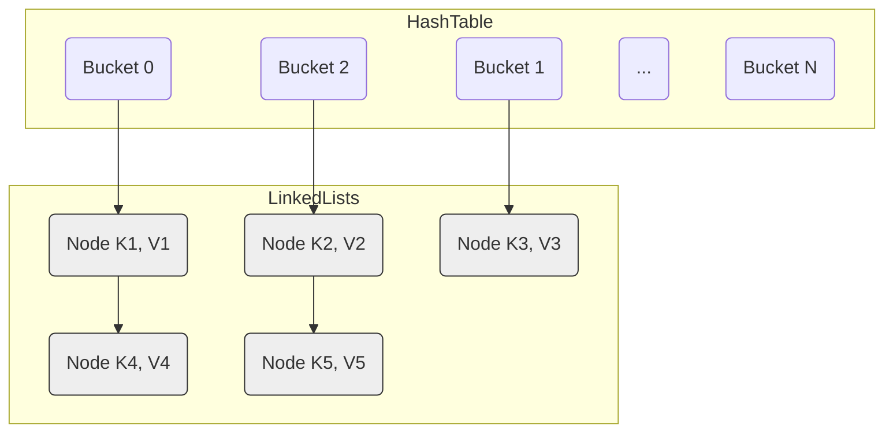
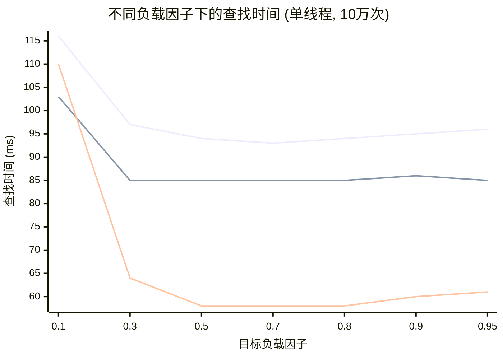

# 现代哈希表 vs. 传统哈希表：深入 Boost.Unordered 的 Flat 与 Concurrent 实现

## 引言

哈希表（Hash Table）是计算机科学中广泛应用的基础数据结构，以其平均 O(1) 的插入、查找和删除效率而闻名。C++ 标准库的 `std::unordered_map` 和 `std::unordered_set` 是其常见代表。然而，随着现代 CPU 架构的发展和对极致性能的追求，哈希表的设计也在不断演进，催生了性能更优但可能牺牲部分标准兼容性的实现。

Boost.Unordered 库正是这一演进的体现，它不仅提供了对标准接口优化的 `boost::unordered_map`，还引入了基于现代设计理念的高性能变体，如开放寻址的 `boost::unordered_flat_map` 和其并发版本 `boost::concurrent_flat_map`。本文将深入探讨传统哈希表与这些现代实现在底层机制、性能表现及并发处理上的核心差异与权衡。

参考资料：
*   [Inside boost::unordered_flat_map](https://bannalia.blogspot.com/2022/11/inside-boostunorderedflatmap.html)
*   [Inside boost::concurrent_flat_map](https://bannalia.blogspot.com/2023/07/inside-boostconcurrentflatmap.html)

## 1. 传统哈希表：分离链表法 (Separate Chaining)

目前，大多数 C++ 标准库 `std::unordered_map` 的实现以及 `boost::unordered_map` 均采用**分离链表法**（Separate Chaining），有时也称作拉链法。

### 1.1 工作机制

*   **桶数组 (Bucket Array)**: 核心是一个指针数组，数组中的每个元素（指针）被称为一个"桶"。
*   **哈希映射**: 计算元素键的哈希值，然后通过取模运算（`hash % bucket_count`）将哈希值映射到桶数组的一个索引上。
*   **冲突处理**: 当多个不同的键哈希到同一个桶索引时，即发生"哈希冲突"。分离链表法将这些冲突的元素组织成一个**链表**（在现代实现中可能是双向链表），并将桶指向这个链表的头节点。
*   **查找**: 首先根据键的哈希值定位到对应的桶，然后顺序遍历该桶关联的链表，逐一比较键值，直至找到目标或遍历结束。



### 1.2 优缺点

**优点:**

*   **实现相对简单**: 冲突处理逻辑清晰明了。
*   **删除操作高效**: 通常只需从链表中移除节点，不会影响其他元素。
*   **节点指针稳定性**: 在基于节点（Node-based）的实现中，只要元素不被删除，指向节点的指针通常保持稳定。即使在其他元素插入或删除时，节点在内存中的位置也不会变化。这对于长期引用容器内元素的应用非常重要。
*   **负载因子适应性强**: 即使负载因子（元素数量 / 桶数量）超过 1，哈希表仍能正常工作，尽管性能会因链表变长而逐渐下降。

**缺点:**

*   **缓存效率低**: 访问一个元素通常需要至少两次指针跳转：一次访问桶数组找到链表头指针，然后一次或多次跳转来遍历链表。由于链表节点在内存中通常不连续，这容易导致 CPU 缓存未命中（Cache Miss）。
*   **额外内存开销**: 每个元素需要额外的节点存储开销（如指向下一个节点的指针，在双向链表中还有前向指针）。这些额外指针可能占用与元素本身相当的内存。
*   **性能瓶颈**: 在现代 CPU 架构中，内存访问延迟往往是主要瓶颈。分离链表法的多次内存跳转使其在高速缓存架构下难以达到最优性能。

在实际标准库实现中，会采用一些优化措施来缓解这些缺点，如使用局部感知哈希（locality-sensitive hashing）、调整桶大小策略、预留内存等，但基本原理保持不变。

## 2. 现代哈希表：开放寻址 (Open Addressing) 与 `boost::unordered_flat_map`

为了突破分离链表法的性能限制，现代高性能哈希表（如 Google 的 Swiss Table、`boost::unordered_flat_map` 等）广泛采用了**开放寻址**（Open Addressing）技术。`boost::unordered_flat_map` 是 Boost 1.81 引入的一种非标准的、性能卓越的开放寻址哈希表实现。

### 2.1 工作机制：直接存储与探测

*   **单一扁平数组**: 与分离链表法不同，开放寻址将所有元素（键值对）直接存储在主存储数组（通常称为槽位数组，Slot Array）中，没有额外的节点结构。
*   **冲突处理 - 探测 (Probing)**: 当插入一个新元素时，计算其哈希值并映射到一个初始槽位索引 `i`。如果该槽位已被占用，则根据预定的**探测序列**（Probing Sequence）检查下一个槽位 `i+k1`, `i+k2`, ...，直到找到一个空槽（`Empty`）或标记为已删除（`Deleted` / `Tombstone`）的槽位为止。
*   **常见的探测策略**:
    *   **线性探测 (Linear Probing)**: 依次检查 `i`, `i+1`, `i+2`, ... (模数组大小)。实现简单，缓存友好性好（访问相邻内存），但容易产生"聚集"（Clustering）现象，即被占用的槽位倾向于连成一片，可能导致探测链过长。
    *   **二次探测 (Quadratic Probing)**: 检查 `i`, `i+1²`, `i+2²`, ... (模数组大小)。可以有效缓解线性探测的主聚集问题。`boost::unordered_flat_map` 内部采用了类似二次探测的策略来寻找空槽。
    *   **双重哈希 (Double Hashing)**: 使用第二个独立的哈希函数来计算探测步长。可以更好地打散元素，但计算开销稍大。

`boost::unordered_flat_map` 属于**非重定位 (Non-relocating)** 的开放寻址，插入新元素不会移动已存在元素的位置（除非发生 Rehashing）。

### 2.2 核心优化：元数据与 SIMD 加速 (借鉴 Swiss Table)

`boost::unordered_flat_map` 的卓越性能很大程度上归功于其借鉴 Google Swiss Table 的设计，特别是利用元数据 (Metadata) 和 SIMD 指令加速查找：

*   **元数据数组 (Metadata Array)**: 除了存储元素的主数组外，还有一个紧凑的**控制字节数组**。主数组中的每个槽位都对应元数据数组中的一个字节。
*   **分组 (Grouping)**: 逻辑上，主数组和元数据数组被划分为固定大小的组 (Group)。`boost::unordered_flat_map` 每组包含 **15 个** 元素槽位，对应 **16 个** 元数据字节（最后一个元数据字节用于溢出标志）。
*   **元数据状态编码**:
    *   **空槽位 (`Empty`)**: 用值 `0` 标记。
    *   **删除槽位 (`Deleted`, 即墓碑 `Tombstone`)**: 用值 `1` 标记。
    *   **哨兵 (`Sentinel`)**: 用于标记最后一个组的结束位置的特殊值。
    *   **使用中槽位 (`Full`)**: 存储由完整哈希值派生出的一个控制字节（称为 `h2` 或 reduced hash），其值经过处理以避开特殊标记值（`Empty`, `Deleted`）。例如，原始哈希值的低位字节 `0` 和 `1` 会被映射到其他值（如 `8` 和 `9`）。
    
    根据源码实现，`reduced_hash()` 函数通过查表将哈希值低8位转换为特定范围的值，确保不会与特殊状态值冲突（会将值 `0` 和 `1` 映射为不同的值，例如 `8` 和 `9`）。
    
*   **SIMD 加速查找**:
    1.  **计算哈希与分组**: 计算待查键 `key` 的完整哈希值 `h`。通过位运算确定目标组 `g` 的索引，同时提取出哈希片段值 `h2` (通过查表得到)。
    2.  **并行比较 (SIMD)**: 使用 SIMD 指令将目标 `h2` 与整个组内 **16 个** 控制字节**同时进行比较**。例如，在 x86 架构上使用 SSE2 的 `_mm_cmpeq_epi8` 指令，ARM 上则使用 `vceqq_u8`。
    3.  **生成掩码**: 使用 `_mm_movemask_epi8` (x86) 或等效函数将 16 字节的 SIMD 比较结果转换为一个 16 位的位掩码 (Bitmask)，每一位对应一个槽位。结果与 `0x7FFF` 进行位与操作，排除最后一个字节（溢出标志位）。
    4.  **快速查找匹配**: 只有当位掩码某位为1时，才会访问对应的元素进行完整键比较。

这种设计有几个主要优势：
*   **减少内存访问**: 查找过程首先只需检查紧凑的元数据，大多数不匹配情况无需访问主元素数组。
*   **SIMD 并行比较**: 一次操作可以比较16个槽位，相当于一组15个元素。
*   **缓存友好**: 元数据数组小且紧凑，更容易完全加载到缓存中。
*   **溢出控制**: 每组的第16个字节用作溢出标志，帮助加速探测过程。


(图片来源:  [bannalia.blogspot.com](https://bannalia.blogspot.com/2022/11/inside-boostunorderedflatmap.html))

### 2.3 删除与墓碑 (Tombstones)

在开放寻址中直接删除元素并将其槽位标记为 `Empty` 会破坏探测链。例如，元素 A 和 B 哈希到同一位置，B 通过探测放在了 A 后面的槽位。如果此时删除 A 并标记为空，那么后续查找 B 时，探测到 A 原来的空槽位就会提前终止，导致 B 找不到。

解决方法是使用**墓碑 (Tombstone)**：

*   当删除一个元素时，不将其槽位设为 `Empty`，而是将其对应的控制字节标记为 `Deleted` 状态（值为 `1`）。
*   **查找**操作遇到 `Deleted` 槽位时，**必须继续探测**，不能停止。
*   **插入**操作可以将新元素直接放入遇到的第一个 `Empty` 或 `Deleted` 槽位，从而可以复用被删除元素的空间。

墓碑的存在意味着逻辑删除的元素仍然占据槽位，虽然可以被复用，但在被复用前会增加查找时的平均探测长度。

### 2.4 Rehashing：扩容与元素迁移

当哈希表中的元素数量增加，负载因子（Load Factor = `size() / bucket_count()`）达到某个阈值时，为了维持较低的冲突率和较短的探测链，需要进行 **Rehashing** 操作：

*   **触发时机**: `boost::unordered_flat_map` 默认的最大负载因子通常设得比较高（如接近 7/8 或 87.5%）。但值得注意的是，由于其内部的 **"anti-drift" 机制**（防止元素偏离其理想位置过远），实际的 Rehashing **可能在达到最大负载因子之前**就被触发。用户**不能**通过 `max_load_factor(z)` 接口改变这个行为。
*   **过程**:
    1.  分配一个新的、更大的主数组和元数据数组（通常是原容量的两倍）。
    2.  遍历旧数组中的所有**有效元素**（状态为 `Full` 的槽位）。
    3.  对于每个有效元素，使用**新的数组容量**重新计算其哈希值对应的理想位置，并按照开放寻址的插入逻辑（包括探测）将其放入新数组中。
    4.  释放旧的数组内存。
*   **元素移动**: 由于元素是直接存储在数组中的，Rehashing 过程必然涉及到元素的**移动构造 (Move Construction)** 或拷贝构造（如果移动构造不可用）。

### 2.5 与标准接口的差异及优缺点

`boost::unordered_flat_map` 为了追求极致性能，在接口和行为上与 `std::unordered_map` 有显著差异：

**优点:**

*   **极高的单线程性能**: 得益于出色的缓存局部性和 SIMD 加速查找，其速度通常远超基于分离链表法的实现。
*   **内存效率高**: 没有节点开销，元数据数组非常紧凑。根据基准测试（见参考文章），其内存占用显著低于基于节点的实现。
*   **更少的内存分配**: 通常仅在 Rehashing 时进行一次（或几次）大的内存分配，避免了每次插入时的小对象分配开销。

**缺点与接口差异:**

*   **`Key` 和 `T` 需要是可移动构造 (MoveConstructible)**: Rehashing 需要移动元素。而 `std::unordered_map` 对此没有要求（拷贝构造即可）。
*   **指针/引用不稳定**: **任何可能导致 Rehashing 的操作**（如 `insert`, `emplace`, `reserve` 等）都会使之前获取的指向元素的指针和引用**全部失效**。`erase` 操作也可能导致部分指针/引用失效。这与 `std::unordered_map` 不同，后者一般在 Rehashing 时使迭代器失效，但通常不影响指向未删除元素的指针/引用（对节点而言）。
*   **`begin()` 非 O(1)**: 寻找第一个元素需要从头开始扫描槽位数组，直到找到第一个 `Full` 状态的槽，最坏情况是 O(N)。
*   **`max_load_factor()` 基本无效**: 用户无法调整触发 Rehashing 的负载因子阈值。
*   **无桶接口 (Bucket API)**: 移除了 `bucket_count()`, `bucket_size()`, `begin(n)`, `end(n)` 等与"桶"概念相关的接口（`bucket_count()` 可能保留但意义不同）。
*   **无节点操作 (Node Handling)**: 没有 `extract`, `insert(node_handle)`, `merge` (节点版本) 等接口，因为 `flat_map` 本身不是基于节点的。`merge` 函数虽可能提供，但其实现是基于元素移动而非节点转移。
*   **实现复杂**: 内部涉及 SIMD 指令、位操作、复杂的探测逻辑和 Rehashing 策略。

## 3. 并发哈希表：`boost::concurrent_flat_map` 详解

在多线程环境下，若直接使用 `boost::unordered_flat_map` 并通过外部互斥锁（如 `std::mutex` 或 `std::shared_mutex`）进行保护，锁会成为全局瓶颈，严重限制并发性能。`boost::concurrent_flat_map` (自 Boost 1.83 起提供) 旨在通过精巧的内部设计，提供细粒度锁和专门的 API，以实现高并发下的高性能访问。

参考资料：[Inside boost::concurrent_flat_map](https://bannalia.blogspot.com/2023/07/inside-boostconcurrentflatmap.html)

### 3.1 设计原则与 API 哲学

`boost::concurrent_flat_map` 的设计遵循几个核心原则：

*   **通用性**: 不对 Key 和 T 类型施加特殊限制（满足 `unordered_flat_map` 的要求即可）。
*   **完全线程安全**: 提供完整的内部同步，用户无需外部加锁。
*   **维持传统模型**: 尽可能保持与非并发容器相似的概念和操作模型，提供线程安全的值语义（拷贝构造、赋值、swap 等）。

最重要的 API 决策是**不提供传统的迭代器接口** (`begin()`, `end()`)。原因如下：

*   **非阻塞迭代器不安全**: 在并发修改下，迭代器可能随时失效或指向错误数据。
*   **阻塞迭代器风险高**: 如果迭代器在访问时持有锁，用户稍有不慎（例如，持有锁的同时尝试获取另一个锁，或长时间持有锁）就可能导致**性能瓶颈**甚至**死锁**。例如：
    ```cpp
    // Thread 1: 可能死锁
    map_type::iterator it1 = map.find(x1); // 持有 x1 的锁
    map_type::iterator it2 = map.find(x2); // 尝试获取 x2 的锁
    
    // Thread 2: 可能死锁
    map_type::iterator it2 = map.find(x2); // 持有 x2 的锁
    map_type::iterator it1 = map.find(x1); // 尝试获取 x1 的锁
    ```

作为替代，`concurrent_flat_map` 提供基于**内部访问 (Visitation)** 的 API，下一节将详述。

### 3.2 底层结构与两级锁机制

`concurrent_flat_map` 沿用了 `unordered_flat_map` 的开放寻址、元数据数组和 SIMD 加速的基础布局。在此之上，它构建了两层精密的锁机制来管理并发访问：

1.  **容器级锁 (Container-Level Lock)**:
    *   **目的**: 保护需要整体修改容器状态的操作，如 Rehashing、`swap`、拷贝/移动赋值、`clear` 等。
    *   **实现**: 使用一个**读写自旋锁数组 (`multimutex<rw_spinlock, N>`)**，每个锁占据独立的**缓存行 (cache line)** 以避免伪共享。
    *   **线程绑定**: 每个线程通过 `thread_local` 变量在首次访问时被**轮询 (round-robin)** 分配到数组中的一个特定自旋锁。
    *   **锁操作**:
        *   **读锁 (Shared)**: 普通操作（包括查找、插入、删除单个元素）只需要获取**读锁**。线程**仅需锁定分配给自己的那个自旋锁**即可。
        *   **写锁 (Exclusive)**: 全局操作（如 Rehashing）需要获取**写锁**，需要**锁定所有自旋锁**。由于这类操作相对稀少，这种设计显著降低了常见操作的锁争用。

2.  **组级锁 (Group-Level Lock)**:
    *   **目的**: 对哈希表内部的每个 Group (包含 15 个槽位和 16 字节元数据) 进行细粒度的访问控制。
    *   **实现**: 每个 Group 关联一个独立的**读写自旋锁 (`rw_spinlock`)**。
    *   **原子插入计数器**: 除了锁之外，每个 Group 还维护一个**原子计数器 (`std::atomic<uint32_t>`)**，用于实现乐观并发插入。

`rw_spinlock` 是一个精心设计的读写锁实现，使用单个 `std::atomic<std::uint32_t>` 存储锁状态：
- 最高位（第31位）表示是否被排他锁定
- 次高位（第30位）表示是否有写入者在等待
- 低30位用于计数有多少线程获取了共享锁

这种两级锁设计极大地降低了高并发场景下的锁争用，是其高性能的关键之一。

### 3.3 核心并发算法

基于上述锁机制，`concurrent_flat_map` 对查找和插入算法进行了优化，以最大限度地减少锁的持有时间和范围：

*   **查找 (Lookup)**:
    1.  **无锁阶段**: 计算哈希值、确定目标 Group、提取 7 位哈希片段 `h2`、使用 SIMD 指令在目标 Group 的元数据中并行匹配 `h2`——这些步骤**完全不涉及任何锁**，也不与元数据的修改同步。
    2.  **加锁阶段**: 当 SIMD 匹配找到一个或多个潜在候选项时，线程需要获取该 Group 对应的**组级读锁**。
    3.  **验证与比较**: 在持有组级读锁的情况下，**再次检查**候选槽位的元数据状态（因为无锁阶段的状态可能已过时），确认其确实是 `Full` 状态且 `h2` 匹配。如果确认，则访问主数组中的元素进行**完整的键比较**。
    4.  释放组级读锁。
    
    查找操作仅在最后极短的时间内持有组级读锁，大大提高了并发读的效率。

*   **插入 (Insertion) - 事务性乐观插入**:
    
    并发插入的主要挑战是防止两个线程同时成功插入相同的键，以及避免因探测序列交叉而导致的死锁。`concurrent_flat_map` 采用了一种**事务性乐观插入 (Transactional Optimistic Insertion)** 策略：
    
    1.  **记录初始状态**: 计算哈希值，确定目标初始 Group `g0`，**读取并保存 `g0` 的原子插入计数器的当前值** (记为 `initial_counter`)。
    2.  **无锁探测**: 从 `g0` 开始，按照探测序列**无锁地**查找第一个可用的槽位（`Empty` 或 `Deleted`）。元数据的访问在此阶段是原子的，但不加锁。
    3.  **获取组锁**: 假设在 Group `g_target` 中找到了可用槽位 `s`。线程尝试获取 `g_target` 的**组级写锁**。
    4.  **验证计数器**: 成功获取写锁后，**再次读取 `g0` 的原子插入计数器**。比较当前值与 `initial_counter`。
        *   **如果计数器未改变**: 这意味着从开始探测到获取写锁期间，没有其他线程成功完成了对 `g0` 区域的插入操作。此时认为插入是安全的。线程将新元素放入槽位 `s`，**原子地更新** `s` 的元数据字节，**并原子地递增 `g0` 的插入计数器**。然后释放 `g_target` 的写锁。插入完成。
        *   **如果计数器已改变**: 这表示在探测过程中，有其他线程修改了与当前插入可能冲突的区域。当前插入可能不再安全。此时，线程**放弃本次插入尝试**，立即释放 `g_target` 的写锁，并**从步骤 1 开始重试整个插入过程**。
    
    这种乐观方法避免了长时间持有锁，也避免了复杂的死锁预防逻辑，依靠原子计数器和重试来保证正确性。

### 3.4 `visit` API：并发环境下的安全访问范式

如前所述，`concurrent_flat_map` 使用基于回调的 `visit` API 替代迭代器：

*   **核心理念**: 将"查找元素"与"对元素执行操作"绑定为一个原子步骤，操作期间持有适当的**组级锁**。
*   **`visit(key, functor)`**: 查找 `key`。若找到，则在持有对应 Group 的**组级排他锁**下调用 `functor(value_type&)`，允许安全读写元素。
*   **`cvisit(key, functor)`**: 类似 `visit`，但在持有对应 Group 的**组级共享锁**下调用 `functor(const value_type&)`，仅允许只读访问。
*   **返回值**: 如果 `visit` 或 `cvisit` 成功找到元素并执行了 `functor`，它们返回 `1`。如果未找到元素，则**返回 `0`** (而不是抛出异常，这一点值得注意)。
*   **全表遍历**: 提供 `visit_all(functor)` 和 `visit_while(functor)` 用于安全遍历。内部会按 Group 依次加锁并访问其中的元素。
*   **批量操作**: 提供 `bulk_visit_size` (值为 16) 常量，允许一次操作多个键，如 `visit(first, last, functor)`。
*   **丰富的原子操作**: 提供 `insert_or_visit`, `emplace_or_visit`, `insert_and_visit`, `emplace_and_visit`, `erase_if` 等 API，内部都封装了必要的查找、加锁和原子操作逻辑。
*   **无标准迭代器**: `begin()/end()` 等迭代器接口不提供。

### 3.5 Rehashing 的挑战与实现

并发环境下的 Rehashing 操作需要协调所有线程进行全局结构调整：

*   **全局暂停策略**: Rehashing 通过获取**容器级写锁**来实现，这意味着需要锁定所有的读写自旋锁，暂时阻塞所有其他线程的访问。
*   **过程**: 在持有容器级写锁后，执行与单线程版本类似的元素迁移（创建新表，重新插入所有元素），然后切换内部指针到新表，最后释放容器级写锁。
*   **性能影响**: 这种全局暂停可能导致短暂的服务停顿。虽然容器级写锁的获取针对低争用做了优化，但 Rehashing 本身的操作耗时仍不可避免。

### 3.6 优缺点

**优点:**

*   **极高并发吞吐量**: 精巧的两级锁机制显著降低了锁争用，性能远超全局锁方案。
*   **缓存友好**: 继承了 `flat_map` 的优秀缓存局部性。
*   **完全线程安全**: 用户无需担心数据竞争或手动同步。
*   **互操作性**: 提供与 `unordered_flat_map` 的相互转换功能（自 Boost 1.83 起），允许多线程构建后转为单线程使用的场景。

**缺点:**

*   **实现极其复杂**: 内部逻辑涉及开放寻址、SIMD、两级细粒度锁、原子操作、乐观并发控制等多种高级技术。
*   **`visit` API 学习成本**: 需要用户适应回调式的编程范式。
*   **单线程性能略有开销**: 即使无竞争，原子操作和锁的获取/释放仍带来微小开销。
*   **Rehashing 可能引入暂停**: 全局暂停式 Rehashing 可能导致性能抖动。
*   **指针/引用不稳定**: 与 `flat_map` 一致，Rehashing 会使元素地址失效。

## 4. 性能基准测试与分析

为了更具体地展示不同哈希表实现的性能差异，以下参考了 [bannalia.blogspot.com](https://bannalia.blogspot.com/) 上发布的基准测试结果。

### 4.1 单线程性能对比

测试包含 100 万个 `std::string` 键值对的插入、500 万次查找（80% 命中）和 100 万次删除。

**测试结果 (`single_thread_results.txt`)**: 

| Map 类型                  | 插入 (ms) | 查找 (ms) | 删除 (ms) |
| :------------------------ | --------: | --------: | --------: |
| `std::unordered_map`      |       266 |      1485 |       148 |
| `boost::unordered_map`    |       201 |      1307 |       134 |
| `boost::unordered_flat_map` |       135 |       900 |        84 |

**数据分析**: 

1.  **`boost::unordered_flat_map` 优势显著**: 
    *   插入性能：比 `std` 快约 **49%** (`(266-135)/266`)，比 `boost` 快约 **33%**。
    *   查找性能：比 `std` 快约 **40%** (`(1485-900)/1485`)，比 `boost` 快约 **31%**。
    *   删除性能：比 `std` 快约 **43%** (`(148-84)/148`)，比 `boost` 快约 **37%**。
    *   这些优势主要源于其开放寻址设计带来的**缓存局部性**提升和**SIMD 加速查找**，极大地减少了内存访问延迟和指令数。
2.  **`boost::unordered_map` 优于 `std::unordered_map`**: 
    *   `boost` 版本在所有操作上都比标准库版本快 10-25%。这表明 Boost 对传统分离链表法的实现进行了更细致的优化，可能包括更优的哈希函数选择、桶管理或内存分配策略。
3.  **查找操作是主要耗时点**: 对于所有 map 类型，查找操作的耗时都远超插入和删除，这凸显了优化查找性能的重要性，也解释了为何现代哈希表着重优化查找路径。

### 4.2 负载因子对单线程性能的影响

测试固定插入 10 万个元素，通过 `reserve` 预设桶数量来控制目标负载因子，然后测试 10 万次查找的时间。

**测试结果 (`single_thread_results.txt` 摘录)**: 

| Map 类型                  | 目标 LF | 实际 LF | 查找时间 (ms) |
| :------------------------ | ------: | ------: | ------------: |
| `std::unordered_map`      |     0.1 |   0.096 |           116 |
|                           |     0.3 |   0.288 |            97 |
|                           |     0.5 |   0.480 |            94 |
|                           |     0.7 |   0.672 |            93 |
|                           |     0.8 |   0.768 |            94 |
|                           |     0.9 |   0.864 |            95 |
|                           |    0.95 |   0.912 |            96 |
| `boost::unordered_map`    |     0.1 |   0.096 |           103 |
|                           |     0.3 |   0.288 |            85 |
|                           |     0.5 |   0.480 |            85 |
|                           |     0.7 |   0.480 |            85 | *注：实际 LF 未达目标值*
|                           |     0.8 |   0.480 |            85 | *注：实际 LF 未达目标值*
|                           |     0.9 |   0.480 |            86 | *注：实际 LF 未达目标值*
|                           |    0.95 |   0.480 |            85 | *注：实际 LF 未达目标值*
| `boost::unordered_flat_map` |     0.1 |   0.096 |           110 |
|                           |     0.3 |   0.288 |            64 |
|                           |     0.5 |   0.480 |            58 |
|                           |     0.7 |   0.672 |            58 |
|                           |     0.8 |   0.768 |            58 |
|                           |     0.9 |   0.864 |            60 |
|                           |    0.95 |   0.912 |            61 |

**负载因子-查找时间折线图 (Mermaid)**:



**数据分析**: 

1.  **`boost::unordered_flat_map` 的性能区间**: 在负载因子 0.5 到 0.8 区间内，`flat_map` 查找性能最佳且稳定（约 58ms）。即使在高负载因子（0.9-0.95）下，性能下降也很有限，表明其探测机制对高负载有良好的适应性。
2.  **`std::unordered_map` 的表现**: 在低负载因子（0.1）下性能较差，随着负载因子增加性能提升，在 0.7 左右达到最佳（约 93ms）。之后性能略有下降，但整体对高负载因子的敏感度低于 `flat_map`。
3.  **`boost::unordered_map` 的特殊行为**: 测试显示，当目标负载因子超过 0.5 时，`boost::unordered_map` 的实际负载因子保持在 0.48 左右，这表明其内部存在**自动 rehash 策略**，限制负载因子不超过某个阈值（约 0.5），从而在不同目标负载因子下保持稳定性能（约 85ms）。这是一种以空间换取稳定性能的优化。
4.  **低负载因子的性能问题**: 所有类型的 map 在极低负载因子（0.1）下性能都较差，原因是大量空间浪费导致需要遍历更多槽位，降低了缓存效率。

### 4.3 多线程性能对比

测试包含 100 万元素，8 个线程执行 1000 万次操作。非并发 map 使用 `std::shared_mutex` 加锁保护。

**测试结果 (`multi_thread_results.txt`)**: 

| Map 类型                       | 单线程插入 (ms) | 单线程查找 (ms) | 多线程插入 (ms) | 多线程查找 (ms) | 多线程混合操作 (ms) |
| :----------------------------- | --------------: | --------------: | --------------: | --------------: | --------------: |
| `std::unordered_map` (加读写锁)    |             386 |            1887 |            2204 |            4197 |            3651 |
| `boost::unordered_map` (加读写锁)  |             398 |            1834 |            2152 |            3741 |            3502 |
| `boost::unordered_flat_map` (加读写锁)|             270 |            1141 |            2390 |            4429 |            4163 |
| `boost::concurrent_flat_map`   |             277 |            1134 |             777 |             169 |             273 |

**数据分析**: 

1.  **`boost::concurrent_flat_map` 的优势**: 
    *   多线程插入：比加锁的 `flat_map` 快约 **67.5%**，比加锁的 `std/boost` 快约 **64-65%**。
    *   多线程查找：比加锁的 `flat_map` 快约 **96%**，比加锁的 `std/boost` 快约 **95-96%**，速度提升超过 **20 倍**。
    *   多线程混合操作：比加锁的 `flat_map` 快约 **93%**，比加锁的 `std/boost` 快约 **92%**，速度提升超过 **12 倍**。
    *   `concurrent_flat_map` 通过分段锁和针对并发场景的优化有效减少了线程竞争，大幅提高了并发吞吐量。
2.  **锁竞争的瓶颈**: 对于使用外部锁的容器，多线程性能远低于单线程，清楚地表明 `std::shared_mutex` 成为严重瓶颈，线程大部分时间在等待锁而非执行实际操作。
3.  **加锁 `flat_map` 的反常表现**: 尽管 `flat_map` 单线程性能最佳，但在全局锁保护下的多线程环境中，其性能（尤其是查找和混合操作）反而略差于加锁的 `std/unordered_map`。可能是因为 `flat_map` 高度依赖缓存局部性，而全局锁导致更频繁的缓存一致性协议流量和缓存行失效，抵消了其单线程优势。相比之下，基于节点的 map 可能对这种缓存扰动不那么敏感。
4.  **单线程效率**: `concurrent_flat_map` 的单线程性能与 `unordered_flat_map` 几乎相同，表明其内部并发控制机制在无竞争情况下几乎没有额外开销。

## 5. 总结与选择建议

Boost.Unordered 库针对不同场景提供了多种哈希表实现，基准测试表明，根据应用场景选择合适的容器对性能影响显著。

**核心容器特性与性能总结:**

*   **`boost::unordered_map`**: 对 `std::unordered_map` 的改进实现，通常提供更好的单线程性能。基于分离链表法，保持了标准接口兼容性和指针/引用稳定性。测试显示其内部可能限制负载因子在 0.5 左右，以保证稳定性能。
*   **`boost::unordered_flat_map`**: 采用开放寻址、SIMD 加速和优化的缓存局部性，在单线程场景下提供出色的性能和内存效率。
    *   **性能**: 单线程查找性能比 `std::unordered_map` 快 40-50%，比 `boost::unordered_map` 快 30% 左右。
    *   **负载因子**: 在 **0.5 - 0.8** 之间性能最佳。
    *   **权衡**: 高性能是以牺牲部分标准接口（如桶接口、节点操作）和指针/引用稳定性为代价的。
*   **`boost::concurrent_flat_map`**: 基于 `flat_map` 设计，通过两级锁机制（容器级分散锁和组级锁）和专门的 `visit` API，在高并发场景下表现优异，有效解决了传统全局锁机制的瓶颈。
    *   **性能**: 多线程性能远超使用外部锁保护的其他容器（查找和混合操作快 10-20 倍）。单线程性能与 `unordered_flat_map` 相当。
    *   **内存**: 比基于节点的 map 更节省内存，但需要额外的锁数组开销。
    *   **接口**: 使用基于回调的 `visit` API 进行安全访问，不提供迭代器。

**选择建议:**

1.  **需要标准接口兼容性、指针/引用稳定性**:
    *   选择 `std::unordered_map` 或 `boost::unordered_map`。后者通常性能更好。

2.  **追求极致单线程性能，可接受指针/引用不稳定**:
    *   选择 `boost::unordered_flat_map`，并将负载因子控制在 0.5-0.8 之间。

3.  **需要高并发读写性能，可接受回调式 API**:
    *   选择 `boost::concurrent_flat_map`。不建议在高并发场景使用外部锁保护非并发 Map，锁竞争会成为严重瓶颈。

Boost.Unordered 提供的这些实现满足了从单线程高性能到大规模并发场景的不同需求。开发者应根据应用的具体需求（性能、并发度、接口兼容性、稳定性）选择最合适的容器。
