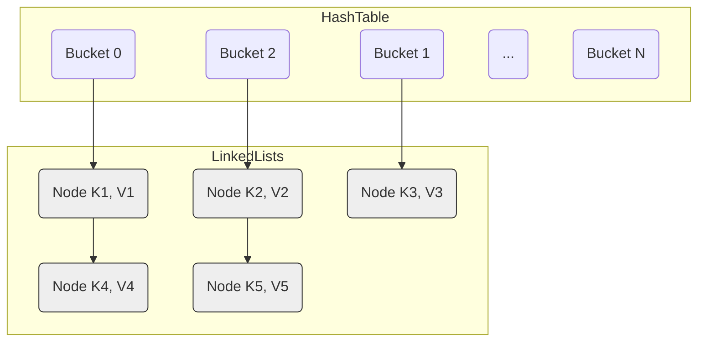

# 现代哈希表 vs. 传统哈希表：深入 Boost.Unordered 的 Flat 与 Concurrent 实现

## 引言

哈希表（Hash Table），或称散列表，是计算机科学中最重要和最常用的数据结构之一。它提供了平均 O(1) 时间复杂度的插入、查找和删除操作。C++ 标准库提供了 `std::unordered_map` 和 `std::unordered_set` 作为标准的哈希表实现。然而，随着 CPU 架构的发展和对性能极致追求的驱动，现代哈希表设计已经超越了传统实现。

Boost.Unordered 库提供了一系列哈希容器，不仅包括对标准接口的优化实现 (`boost::unordered_map`)，还引入了基于现代设计理念的高性能变体，如 `boost::unordered_flat_map` 和 `boost::concurrent_flat_map`。本文将深入探讨传统哈希表与这些现代哈希表在实现机制、性能特点和并发处理上的差异。

参考资料：[Inside boost::unordered_flat_map](https://bannalia.blogspot.com/2022/11/inside-boostunorderedflatmap.html)

## 1. 传统哈希表：分离链表法 (Separate Chaining)

大多数 C++ 标准库的 `std::unordered_map` 以及 `boost::unordered_map` 采用的是**分离链表法**（也称拉链法）。

### 1.1 工作机制

*   **桶数组 (Bucket Array)**: 内部维护一个指针数组，每个指针称为一个"桶"。
*   **哈希映射**: 元素的键通过哈希函数计算得到一个哈希值，该哈希值再通过取模等方式映射到桶数组的一个索引上。
*   **冲突处理**: 如果多个元素的键哈希到同一个桶索引（发生冲突），则这些元素会被存储在一个**链表**中，桶数组的对应位置存储指向该链表头节点的指针。
*   **查找**: 先定位到桶，然后遍历桶对应的链表，逐个比较键值，直到找到目标元素或遍历完链表。

### 1.2 优缺点

**优点:**

*   **实现相对简单**: 冲突处理逻辑清晰。
*   **删除简单**: 只需在链表中删除节点。
*   **指针/引用稳定性 (节点层面)**: 只要元素不被删除，存储元素的**节点**地址通常是稳定的（除非节点实现方式特殊），指向元素的指针（如果用户存储了指向节点的指针）不会因其他元素的插入/删除或 Rehashing 而失效。*注意：标准接口保证迭代器在 Rehashing 后失效，但不保证指向元素的指针/引用一定稳定。*
*   **对高负载因子不敏感**: 即使负载因子（元素数量/桶数量）超过 1，性能下降也相对平缓（链表变长）。

**缺点:**

*   **缓存效率低**: 访问元素需要至少两次内存跳转（桶数组 -> 链表节点 -> 元素数据），链表节点的内存通常不连续，容易导致 CPU 缓存未命中 (Cache Miss)。
*   **内存分配开销**: 每个元素都需要一个额外的链表节点，带来额外的内存分配/释放开销和内存碎片。
*   **性能瓶颈**: 内存访问延迟通常是现代 CPU 上的主要性能瓶颈，分离链表法的多次间接访问限制了其性能上限。

## 2. 现代哈希表：开放寻址 (Open Addressing) 与 `boost::unordered_flat_map`

为了克服分离链表法的性能瓶颈，现代高性能哈希表（如 Google 的 Swiss Table, `boost::unordered_flat_map`）普遍采用**开放寻址**技术。

### 2.1 工作机制

*   **单一数组**: 所有元素都直接存储在哈希表的主数组（桶数组）自身中，没有额外的节点或链表。
*   **冲突处理 - 探测 (Probing)**: 当插入元素时，如果其哈希值对应的槽位已被占用，则按照一个预定的**探测序列**（Probing Sequence）去检查数组中的下一个槽位，直到找到一个空槽（`Empty`）或标记为已删除（`Deleted`）的槽位。
*   **常见的探测策略**:
    *   **线性探测 (Linear Probing)**: 检查 `i`, `i+1`, `i+2`, ... 简单但易产生聚集 (Clustering)。
    *   **二次探测 (Quadratic Probing)**: 检查 `i`, `i+1^2`, `i+2^2`, ... （或类似变体）可以缓解聚集。`boost::unordered_flat_map` 使用了此类策略。
    *   **双重哈希 (Double Hashing)**: 使用第二个哈希函数决定探测步长。

### 2.2 关键优化：SIMD 加速与元数据 (Swiss Table 启发)

`boost::unordered_flat_map` 的设计深受 Google Swiss Table 的影响，其高性能的关键在于：

*   **元数据数组 (Control Byte Array)**: 除了存储元素的主数组外，还有一个并行的、紧凑的**控制字节数组**。每个控制字节（通常 1 byte）对应主数组的一个槽位。
*   **控制字节编码**:
    *   **状态位**: 控制字节的高位用于标记槽位状态：`Empty`（空）、`Deleted`（墓碑）、`Full`（有元素）。特殊值如 `Sentinel` 可能用于标记数组末尾。
    *   **哈希片段 (h2)**: 控制字节的低位（通常 7 位）存储对应元素**原始哈希值的一部分**。
*   **SIMD 加速查找**:
    1.  计算待查键的哈希值 `h`，得到两部分：`h1` 用于定位初始**组 (Group)**，`h2` 是 7 位哈希片段。
    2.  **并行匹配**: 使用 SIMD 指令（如 SSE2 的 `_mm_cmpeq_epi8`, `_mm_movemask_epi8`）一次性将目标 `h2` 与组内（例如 16 个）所有控制字节的哈希片段进行比较。
    3.  **快速过滤**: SIMD 指令返回一个位掩码 (bitmask)，指示哪些槽位的 `h2` 匹配。同时结合状态位，可以快速过滤掉 `Empty`、`Deleted` 以及 `h2` 不匹配的 `Full` 槽位。
    4.  **精确比较**: 只有当 `h2` 匹配且槽位为 `Full` 时，才需要访问主数组中对应的元素，进行完整的键比较 (`key_equal`)。
*   **缓存友好**: 这种设计极大地减少了内存访问次数。大部分不匹配的槽位仅通过访问紧凑且连续的控制字节数组就被排除了，主数组的访问大大减少。控制字节和主数组的连续存储也提高了缓存局部性。

(图片来源: [bannalia.blogspot.com](https://bannalia.blogspot.com/2022/11/inside-boostunorderedflatmap.html))

### 2.3 删除与墓碑 (Tombstones)

在开放寻址中，不能简单地将被删除元素的槽位设为 `Empty`，因为这会中断探测链，导致后续查找失败。解决方法是使用**墓碑 (Tombstone)**：

*   将被删除元素的槽位标记为 `Deleted` 状态（通过控制字节）。
*   查找操作遇到 `Deleted` 槽位时会继续探测。
*   插入操作可以将新元素放入 `Deleted` 槽位，从而回收空间。

### 2.4 Rehashing

当负载因子（`size / capacity`）达到某个阈值（例如 7/8）时，为了维持性能，需要进行 Rehashing：

*   分配一个更大的新数组（主数组 + 控制字节数组）。
*   遍历旧数组中的所有 `Full` 元素。
*   重新计算每个元素在新数组中的位置（基于新容量）并插入。
*   **元素移动**: 这个过程涉及到元素的**移动构造 (Move Construction)**，因为元素是直接存储在数组中的。

### 2.5 优缺点

**优点:**

*   **极高的单线程性能**: 优异的缓存局部性和 SIMD 加速查找带来了非常高的速度。
*   **内存效率高**: 没有额外的节点开销，元数据数组很紧凑。
*   **更少的内存分配**: 通常只需要一次（或几次）大的内存分配，而不是每次插入都分配小节点。

**缺点:**

*   **实现复杂**: 涉及 SIMD、位操作、复杂的探测和 Rehashing 逻辑。
*   **对高负载因子敏感**: 负载因子过高时，探测链变长，性能急剧下降。
*   **删除操作相对复杂**: 需要墓碑机制，可能导致逻辑删除的槽位积累，影响性能（除非 Rehashing 或插入时回收）。
*   **指针/引用不稳定**: Rehashing 会移动元素，导致之前获取的指向元素的指针或引用失效。
*   **对 `Key` 和 `T` 有 `MoveConstructible` 要求**: 因为 Rehashing 需要移动元素。

## 3. 并发哈希表：`boost::concurrent_flat_map` 详解

在多线程环境下，直接使用 `boost::unordered_flat_map` 并用外部锁（如 `std::mutex`）保护整个容器，会导致严重的性能瓶颈，因为锁变成了全局争用点。`boost::concurrent_flat_map` 旨在提供高并发性能。

### 3.1 基础：开放寻址

`boost::concurrent_flat_map` 仍然基于 `boost::unordered_flat_map` 的开放寻址和 SIMD 加速设计，以继承其良好的缓存性能。

### 3.2 并发控制策略：分段锁 (Striped Locking)

为了允许多个线程同时操作哈希表的不同部分，它采用了**分段锁**（也称锁条带化）策略：

*   **锁数组**: 内部维护一个读写锁数组（例如 `multimutex<rw_spinlock, N>`），包含 `N` 个独立的读写锁。
*   **锁映射**: 每个锁负责保护哈希表的一部分（一个或多个 group）。元素的哈希值或其对应的 group 索引被用来确定该元素属于哪个锁的保护范围。
*   **读写锁 (`rw_spinlock`)**: 允许多个线程同时持有**共享锁 (Shared Lock)** 来读取同一个段，但只允许一个线程持有**排他锁 (Exclusive Lock)** 来写入该段。这大大提高了读多写少场景下的并发度。
*   **原子计数器**: 使用 `std::atomic` 来安全地管理容器的大小 (`size`) 和负载阈值 (`ml`)。
*   **缓存行对齐**: 锁和原子计数器通常会做缓存行对齐，以避免**伪共享 (False Sharing)**。

### 3.3 `visit` API：并发安全的访问方式

传统迭代器在并发修改下极易失效，难以保证安全。因此，`boost::concurrent_flat_map` 引入了一套基于回调函数的 **`visit` API**：

*   **核心思想**: 将"查找元素"和"操作元素"绑定为一个原子操作。
*   **`visit(key, functor)`**: 查找 `key`。如果找到，则在持有对应段的**排他锁**的情况下，调用 `functor(element)`，允许安全地读写元素。
*   **`cvisit(key, functor)`**: 类似 `visit`，但在持有**共享锁**的情况下调用 `functor(const_element)`，只允许只读访问。
*   **`visit_all(functor)` / `visit_while(functor)`**: 安全地遍历所有元素并应用 `functor`（通常需要依次获取所有段的锁）。
*   **`insert_or_visit` / `emplace_or_visit` / `try_emplace_or_visit`**: 原子地尝试插入/构造；如果元素已存在，则改为调用 `visit` 回调。
*   **`insert_and_visit` / `emplace_and_visit` / `try_emplace_and_visit`**: 原子地插入/构造（或找到已存在元素），然后对该元素调用 `visit` 回调。
*   **无迭代器**: 通常不提供标准 `begin()` / `end()` 接口。

### 3.4 Rehashing 的挑战

并发环境下的 Rehashing 非常复杂。`boost::concurrent_flat_map` 的 `resize` 操作很可能需要：

1.  获取**所有分段锁**的排他锁（相当于一个全局锁）。
2.  暂停所有其他线程的访问。
3.  执行与非并发版本类似的元素迁移。
4.  释放所有锁。

这个全局暂停可能导致性能抖动。更高级的并发哈希表可能会采用更复杂的增量式或分阶段 Rehashing 策略来避免全局暂停，但这会显著增加实现的复杂度。

### 3.5 优缺点

**优点:**

*   **高并发吞吐量**: 分段锁显著减少了锁争用，性能远超外部全局锁方案。
*   **缓存友好**: 继承了开放寻址的优点。

**缺点:**

*   **实现非常复杂**: 结合了开放寻址、SIMD 和细粒度并发控制。
*   **`visit` API 学习曲线**: 需要适应与传统迭代器不同的编程范式。
*   **单线程性能略低于非并发 `flat` 版本**: 存在锁和原子操作的开销。
*   **Rehashing 可能导致暂停**: 全局锁可能引起性能抖动。
*   **指针/引用不稳定**: 与 `flat` 版本相同。

## 4. 结论

现代哈希表设计，特别是基于开放寻址和 SIMD 加速的实现（如 `boost::unordered_flat_map`），在单线程性能和内存效率方面相比传统的分离链表法有了显著提升，代价是实现复杂度和指针/引用的不稳定性。

对于需要高并发访问的场景，`boost::concurrent_flat_map` 通过分段锁和 `visit` API 提供了强大的解决方案，实现了高吞吐量，但用户需要适应新的 API 范式并理解其固有的复杂性与性能权衡。

选择哪种哈希表取决于具体的应用需求：

*   **需要接口兼容性、指针稳定性（节点层面）或对实现简单性有要求**: 选择 `std::unordered_map` 或 `boost::unordered_map`。
*   **追求极致单线程性能，且可以接受指针/引用不稳定**: 选择 `boost::unordered_flat_map`。
*   **需要高并发读写性能，且可以接受指针/引用不稳定和 `visit` API**: 选择 `boost::concurrent_flat_map`。
*   **同时需要高并发和指针稳定性**: 选择 `boost::concurrent_node_map`（本文未详述，但结合了并发和节点存储）。

理解这些不同实现背后的设计理念和权衡，有助于我们在实际开发中做出更合适的选择。 