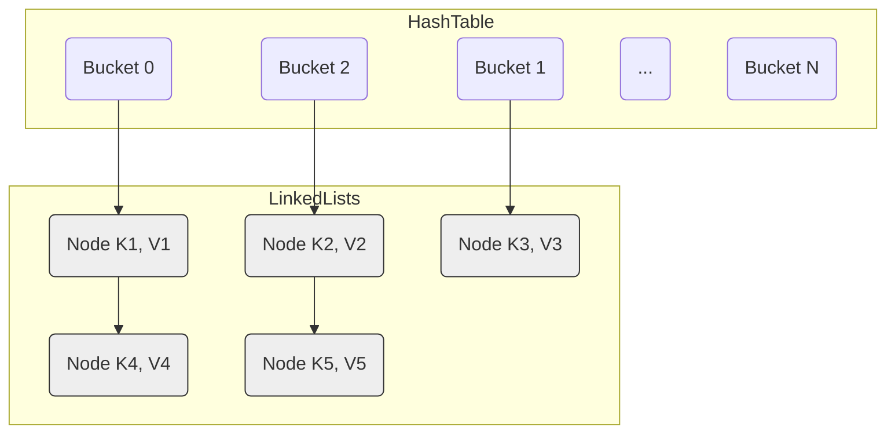

# Boost.Unordered 项目学习笔记

## 项目概述

`Boost.Unordered` 是一个 C++ 库，提供了多种哈希容器实现，旨在提供比标准库 `<unordered_map>`, `<unordered_set>` 等更高的性能和更丰富的功能。该库是 header-only 的，意味着不需要单独编译，只需包含头文件即可使用。

## 主要功能/组件

`Boost.Unordered` 提供了以下几类哈希容器：

1.  **标准兼容容器**:
    *   `boost::unordered_set`
    *   `boost::unordered_map`
    *   `boost::unordered_multiset`
    *   `boost::unordered_multimap`
    *   特点：完全符合 C++ 标准对无序容器的要求，但通常比对应标准库实现更快，并支持最新的 C++ 标准特性（如异构查找、`try_emplace`、`contains` 等），即使在旧的 C++ 版本下也可以使用。

2.  **开放寻址容器 (Flat)**:
    *   `boost::unordered_flat_set`
    *   `boost::unordered_flat_map`
    *   特点：基于开放寻址技术，是所有提供容器中性能最高的。为了追求极致性能，可能在某些方面与标准接口略有差异。

3.  **节点式开放寻址容器 (Node)**:
    *   `boost::unordered_node_set`
    *   `boost::unordered_node_map`
    *   特点：`flat` 容器的变种，提供了指针稳定性（即元素的地址在插入/删除后不会改变）。

4.  **并发 Flat 容器**:
    *   `boost::concurrent_flat_set`
    *   `boost::concurrent_flat_map`
    *   特点：专为多线程环境设计，提供高并发性能。引入了一套新的、无迭代器的 API。

5.  **并发 Node 容器**:
    *   `boost::concurrent_node_set`
    *   `boost::concurrent_node_map`
    *   特点：`concurrent_flat` 容器的变种，同样提供了指针稳定性。

## 功能关系图 (Mermaid)

```mermaid
graph TD
    A[Boost.Unordered] --> B(标准兼容);
    A --> C(开放寻址);
    A --> D(并发);

    subgraph 标准兼容容器
        B1[boost::unordered_(set|map)]
        B2[boost::unordered_(multiset|multimap)]
        B1 -- 特点 --> BF1(符合标准)
        B1 -- 特点 --> BF2(比 std:: 快)
        B1 -- 特点 --> BF3(最新标准特性)
        B2 -- 特点 --> BF1
        B2 -- 特点 --> BF2
        B2 -- 特点 --> BF3
    end

    subgraph 开放寻址容器
        C1[boost::unordered_flat_(set|map)]
        C2[boost::unordered_node_(set|map)]
        C1 -- 特点 --> CF1(性能最高)
        C1 -- 特点 --> CF2(开放寻址)
        C2 -- 派生自 --> C1
        C2 -- 特点 --> CF3(指针稳定)
        C2 -- 特点 --> CF2
    end

    subgraph 并发容器
        D1[boost::concurrent_flat_(set|map)]
        D2[boost::concurrent_node_(set|map)]
        D1 -- 特点 --> DF1(高并发性能)
        D1 -- 特点 --> DF2(无迭代器 API)
        D2 -- 派生自 --> D1
        D2 -- 特点 --> DF3(指针稳定)
        D2 -- 特点 --> DF1
        D2 -- 特点 --> DF2
    end

    C -- 技术基础 --> A
    D -- 技术基础 --> C
```

## 如何使用

`Boost.Unordered` 是 header-only 库，可以通过以下方式获取和使用：

*   下载完整的 Boost 发行版。
*   使用包管理器如 Conan 或 vcpkg 安装 `boost-unordered`。
*   使用 CMake 的 Boost 支持来集成。

## 获取支持与贡献

*   可以通过 CppLang Slack (`#boost-unordered` 频道)、Boost 用户邮件列表提问。
*   可以在 GitHub 仓库提交 Issue 或 Pull Request (针对 `develop` 分支)。

---

这份笔记提供了 `Boost.Unordered` 的高层概览。我们可以进一步深入研究某个具体的容器类型、其内部实现、性能基准或者示例代码。你想接下来了解哪部分内容呢？

## 容器实现细节

### 1. 标准兼容容器 (`boost::unordered_(multi)set/map`)

**头文件:**

*   `boost/unordered/unordered_set.hpp`
*   `boost/unordered/unordered_map.hpp`

**核心实现:**

*   这些容器旨在提供与 C++ 标准库 (`std::unordered_set`, `std::unordered_map`, `std::unordered_multiset`, `std::unordered_multimap`) **接口兼容** 的实现。
*   底层数据结构采用了经典的 **分离链表法 (Separate Chaining)** 来解决哈希冲突。
    *   内部维护一个桶数组 (bucket array)。
    *   每个桶指向一个链表（或其他节点结构），存储所有哈希到该桶的元素。
*   **性能优化**:
    *   虽然接口兼容，但 Boost 的实现通常比标准库的对应版本有更好的性能。这可能源于更优化的哈希函数、桶管理策略或内存分配方式。
    *   Boost 实现会跟进并支持最新的 C++ 标准特性，例如 C++17 的 `try_emplace`、C++20 的 `contains`、异构查找 (heterogeneous lookup) 等，使得在旧 C++ 标准下也能使用这些新特性。
*   **依赖**: 实现细节主要位于 `boost/unordered/detail/set.hpp` 和 `boost/unordered/detail/map.hpp` 中的内部 `table` 类。`set` 和 `map` 共享了大部分底层逻辑，`multiset` 和 `multimap` 也是如此。
*   **`set` vs `map`**: `set` 的 `value_type` 和 `key_type` 是相同的，而 `map` 的 `value_type` 是 `std::pair<const key_type, mapped_type>`。
*   **`multi` vs unique**: `unordered_set/map` 通过 `emplace_unique` 等内部函数保证键的唯一性；而 `unordered_multiset/multimap` 允许重复键，插入操作直接添加。

**Mermaid 图示 (分离链表法)**


**总结:**

这类容器是需要标准接口兼容性时的可靠选择，并且通常能提供比标准库更好的性能和更及时的特性支持。它们是理解哈希表基础实现（分离链表）的一个好起点。 

### 2. 开放寻址容器 (`boost::unordered_flat_set/map`)

**头文件:**

*   `boost/unordered/unordered_flat_set.hpp`
*   `boost/unordered/unordered_flat_map.hpp`

**核心实现:**

*   这类容器的核心是 **开放寻址 (Open Addressing)** 技术，旨在最大化缓存局部性 (cache locality) 并减少指针间接引用，从而实现非常高的性能。
*   **与分离链表法的区别:** 开放寻址不使用链表来存储冲突的元素。相反，所有元素都直接存储在哈希表的主数组（桶数组）中。当发生哈希冲突时（即计算出的哈希索引已被占用），它会通过一种 **探测序列 (Probing Sequence)** 寻找数组中的下一个可用空槽 (slot) 来存储元素。
*   **实现细节:**
    *   同样依赖于一个内部的 `table` 类，但这次位于 `boost/unordered/detail/foa/table.hpp` (`foa` 可能代表 'flat open addressing')。
    *   Boost 的实现采用了**二次探测 (Quadratic Probing)** 的变种或者其他高效的探测策略（如 [Robin Hood Hashing](https://programming.guide/robin-hood-hashing.html) 的思想可能被借鉴）来解决冲突，并有效地处理删除操作（需要标记已删除的槽，而不是直接置空，以保证探测链的连续性）。
    *   为了进一步优化，它可能会使用 SIMD 指令（如果可用）来并行检查多个桶的状态。
    *   数据通常存储在一个连续的内存块中，这极大地提高了 CPU 缓存命中率。
*   **接口差异**: 虽然接口很大程度上与标准兼容容器相似，但为了性能，可能存在一些细微差异。例如，`load_factor` 的管理和 `rehash` 的行为可能不同，因为开放寻址通常在负载因子较低时（例如 0.5 到 0.8 之间）性能最佳。
*   **优点**: 查找、插入和删除操作在平均情况下非常快，尤其是当缓存命中率高时。内存开销相对较小，因为它不需要为链表节点分配额外的内存。
*   **缺点**: 当负载因子变得很高时，性能会急剧下降，因为探测序列可能变得很长。删除操作相对复杂，需要特殊标记（逻辑删除）。指针和引用**不稳定**，因为 rehashing 会移动元素。
*   `flat_set` 和 `flat_map` 的区别与标准容器类似（一个存键，一个存键值对）。

**Mermaid 图示 (开放寻址 - 线性探测示例)**

```mermaid
graph TD
    subgraph HashTable (Single Array)
        direction LR
        S0[Slot 0: Empty]
        S1[Slot 1: (K1, V1) hash=1]
        S2[Slot 2: (K2, V2) hash=2]
        S3[Slot 3: (K3, V3) hash=1] -->|冲突, 探测 +1| S4(Slot 4: (K4, V4) hash=4)
        S5[Slot 5: Empty]
        S6[Slot 6: (K5, V5) hash=1] -->|冲突, 探测 +1| S7{Slot 7: (K6, V6) hash=4} -->|冲突, 探测 +1| S8[Slot 8: Empty]
        S9[...]
    end

    %% Highlighting the probe sequence for K3 and K5 (hash=1)
    style S1 fill:#f9f,stroke:#333,stroke-width:2px
    style S3 fill:#ccf,stroke:#333,stroke-width:2px
    style S6 fill:#f9f,stroke:#333,stroke-width:2px
    style S7 fill:#f9d,stroke:#333,stroke-width:2px
    style S4 fill:#ccf,stroke:#333,stroke-width:2px

    %% Showing where elements ended up after probing
    K3 --> S3
    K5 --> S6
```
*(注意: Boost 的实际探测策略比简单的线性探测更复杂)*

**总结:**

`unordered_flat_set/map` 是追求极致单线程性能时的首选。它们通过牺牲指针稳定性和对高负载因子的容忍度，换来了极佳的缓存友好性和操作速度。非常适合性能关键且元素地址稳定性不重要的场景。 

### 3. 节点式开放寻址容器 (`boost::unordered_node_set/map`)

**头文件:**

*   `boost/unordered/unordered_node_set.hpp`
*   `boost/unordered/unordered_node_map.hpp`

**核心实现:**

*   这类容器是 `unordered_flat_set/map` 的变种，同样基于 **开放寻址** 技术，但关键目标是提供 **指针/引用稳定性 (Pointer/Reference Stability)**。
*   **如何实现指针稳定?** 与 `flat` 版本直接在主数组中存储 `value_type` 不同，`node` 版本在主数组（哈希表）中存储指向实际元素节点的 **指针** 或 **句柄 (handle)**。实际的元素 (`value_type`) 则存储在通过分配器单独分配的**节点 (Node)** 对象中。
    *   当发生 rehashing 时，只需要移动主数组中的指针/句柄，而存储元素的节点本身不需要移动，因此指向元素的指针/引用保持有效。
*   **实现细节:**
    *   依赖于与 `flat` 版本相同的底层 `boost::unordered::detail::foa::table` 实现，但配置了不同的类型参数 (`node_map_types`, `node_set_types`) 来处理节点。
    *   引入了 `node_type` (例如 `detail::foa::node_map_handle`) 的概念，这是 C++17 `std::map::node_type` 的类似物，允许从容器中提取节点并在之后重新插入，或者转移到另一个兼容的容器中，而无需重新分配或复制元素。
*   **性能权衡:**
    *   **优点**: 提供了指针稳定性，这对于某些算法或数据结构（例如，存储指向容器内其他元素的指针）至关重要。支持节点操作 (`extract`, `insert(node_type)`) 提供了更灵活的元素所有权管理。
    *   **缺点**: 相较于 `flat` 版本，性能略有下降。因为需要额外的指针间接引用（主数组 -> 节点）才能访问元素，这可能导致缓存未命中率略微增加。同时，为每个节点单独分配内存也可能带来额外的内存分配开销和碎片化。
*   **接口**: 接口与 `flat` 版本非常相似，但增加了与 `node_type` 相关的操作。
*   `node_set` 和 `node_map` 的区别依然是存储键还是键值对。

**Mermaid 图示 (节点式开放寻址)**

```mermaid
graph TD
    subgraph HashTable (Array of Pointers/Handles)
        direction LR
        S0[Slot 0: Empty]
        S1[Slot 1: ptr1]
        S2[Slot 2: ptr2]
        S3[Slot 3: ptr3] -->|冲突, 探测| S4(Slot 4: ptr4)
        S5[Slot 5: Empty]
        S6[Slot 6: ptr5] -->|冲突, 探测| S7{Slot 7: ptr6} -->|冲突, 探测| S8[Slot 8: Empty]
        S9[...]
    end

    subgraph Nodes (Separately Allocated)
        N1[(Node K1, V1)]
        N2[(Node K2, V2)]
        N3[(Node K3, V3)]
        N4[(Node K4, V4)]
        N5[(Node K5, V5)]
        N6[(Node K6, V6)]
    end

    ptr1 --> N1
    ptr2 --> N2
    ptr3 --> N3
    ptr4 --> N4
    ptr5 --> N5
    ptr6 --> N6

    style N1 fill:#eee,stroke:#333,stroke-width:1px
    style N2 fill:#eee,stroke:#333,stroke-width:1px
    style N3 fill:#eee,stroke:#333,stroke-width:1px
    style N4 fill:#eee,stroke:#333,stroke-width:1px
    style N5 fill:#eee,stroke:#333,stroke-width:1px
    style N6 fill:#eee,stroke:#333,stroke-width:1px
```

**总结:**

`unordered_node_set/map` 在 `flat` 版本的高性能和标准容器的指针稳定性之间提供了一种折中。当你需要开放寻址带来的大部分性能优势，同时又不能牺牲元素指针/引用的稳定性时，这是一个很好的选择。节点操作也带来了额外的灵活性。 

### 4. 并发 Flat 容器 (`boost::concurrent_flat_set/map`)

**头文件:**

*   `boost/unordered/concurrent_flat_set.hpp`
*   `boost/unordered/concurrent_flat_map.hpp`

**核心实现:**

*   这类容器专为 **高并发** 读写场景设计，同样基于 **开放寻址** 技术以获得良好的缓存性能。
*   **并发控制:**
    *   内部实现 (`boost::unordered::detail::foa::concurrent_table`) 采用了细粒度的锁策略或无锁技术（可能结合原子操作和内存顺序控制）来允许多个线程同时安全地访问和修改哈希表。
    *   常见的技术可能包括：对每个桶或一小组桶使用独立的锁，或者使用更高级的并发哈希表算法（如 [Cliff Click's Non-Blocking Hash Map](https://www.youtube.com/watch?v=WYXgtXWejRM) 的变种）。
    *   目标是最小化线程间的争用，最大化并行度。
*   **新的 API - `visit`**: 由于在并发环境下，传统的迭代器模型难以安全高效地实现（迭代器可能在遍历过程中因其他线程的修改而失效），这类容器引入了一套基于 **`visit`** 的 API。
    *   `visit(key, functor)`: 查找指定的键 `key`，如果找到，则对该元素（在持有锁或保证安全的上下文中）调用用户提供的 `functor`。`functor` 可以读取或修改元素。
    *   `cvisit(key, functor)`: 功能类似，但 `functor` 只能读取元素（const 访问）。
    *   `visit_all(functor)`: 遍历容器中的所有元素，并对每个元素调用 `functor`。
    *   `visit_while(functor)`: 类似 `visit_all`，但当 `functor` 返回 `false` 时停止遍历。
    *   `insert_or_visit(...)`, `emplace_or_visit(...)`, `try_emplace_or_visit(...)`: 原子地尝试插入/构造元素，如果元素已存在，则调用 `visit` functor。
    *   `insert_and_visit(...)`, `emplace_and_visit(...)`, `try_emplace_and_visit(...)`: 原子地插入/构造元素，并对新插入或已存在的元素调用 `visit` functor。
    *   这些 `visit` 风格的 API 确保了对元素的操作是在并发安全的上下文中进行的。
*   **无迭代器**: 通常不提供标准意义上的 `begin()` 和 `end()` 迭代器接口。
*   **性能**: 旨在提供比使用全局锁的标准容器（或 `boost::unordered_flat_map` 外加外部锁）高得多的多线程并发性能。单线程性能可能略低于非并发的 `flat` 版本，因为需要额外的同步开销。
*   **指针稳定性**: 与 `flat` 版本一样，元素的指针和引用是 **不稳定** 的。
*   `concurrent_flat_set` 和 `concurrent_flat_map` 的区别仍然是存储键还是键值对。

**总结:**

`concurrent_flat_set/map` 是需要高并发读写性能时的强大选择。它们通过采用细粒度并发控制和新的 `visit` API 范式，解决了传统哈希表在多线程环境下的伸缩性瓶颈。适用于需要多个线程频繁、同时访问和修改共享哈希表的场景，但需要适应其独特的、无迭代器的 API。 

### 5. 并发 Node 容器 (`boost::concurrent_node_set/map`)

**头文件:**

*   `boost/unordered/concurrent_node_set.hpp`
*   `boost/unordered/concurrent_node_map.hpp`

**核心实现:**

*   这类容器是 **并发 Flat 容器** 和 **节点式开放寻址容器** 的结合体，目标是同时提供 **高并发性能** 和 **指针稳定性**。
*   **结合方式:**
    *   它们使用与 `concurrent_flat_set/map` 相同的底层并发控制机制 (`detail::foa::concurrent_table`) 来保证线程安全。
    *   同时，它们采用与 `unordered_node_set/map` 类似的方法，在哈希表的主数组中存储指向 **单独分配的节点** 的指针/句柄，而不是直接存储元素值，以此来实现指针稳定性。
*   **API**: 同样采用了基于 **`visit`** 的、无迭代器的 API 来进行并发安全的操作。也支持 `node_type` 的 `extract` 和 `insert` 操作。
*   **性能权衡:**
    *   **优点**: 在需要高并发访问的同时，保证了元素的指针/引用稳定性，并提供了节点操作的灵活性。这是其独特价值所在。
    *   **缺点**: 性能可能是所有变体中最低的（尽管并发性能仍远优于粗粒度锁方案）。它结合了并发控制的开销（相比非并发版本）和节点存储的开销（相比 flat 版本，有额外的指针间接引用和内存分配）。
*   `concurrent_node_set` 和 `concurrent_node_map` 的区别仍然是存储键还是键值对。

**总结:**

`concurrent_node_set/map` 是 Boost.Unordered 中功能最全面的哈希表，适用于那些**同时**需要高并发读写和指针稳定性的复杂场景。如果只需要两者之一，那么选择 `concurrent_flat` 或 `unordered_node` 版本可能会获得更好的性能。使用时同样需要适应其 `visit` API。

---

我们已经概览了 Boost.Unordered 提供的所有主要哈希容器类型的实现细节。希望这些笔记对你的学习有所帮助！如果你想深入了解某个特定容器的更底层细节（例如具体的探测策略、并发控制细节等），或者想看看示例代码，请告诉我。 

## `flat` 与 `concurrent flat` 容器深入探究

这两类容器都基于开放寻址和类似 Swiss Table 的设计，但 `concurrent` 版本增加了并发控制机制。

### `boost::unordered_flat_set/map` (`detail::foa::table`)

1.  **存储结构:**
    *   核心是主元素数组 (`elements_`) 和一个并行的 **控制字节数组 (control bytes)**，通常位于 `groups_` 指针指向的内存区域。
    *   每个控制字节对应一个元素槽位，存储状态 (`Empty`, `Deleted`, `Full`) 和 **7 位哈希片段 (h2 hash)**。
    *   `group_type` (如 `group16`) 处理 16 个控制字节和对应元素槽位，利用 SIMD 进行快速匹配。
2.  **探测策略:**
    *   采用**二次探测 (Quadratic Probing)**。`prober` 类根据初始哈希位置 `pos0` 和掩码 `mask` 计算探测序列。
    *   查找 (`find_`) 时，先计算 `h1` (用于定位初始 group) 和 `h2` (7 位哈希片段)。
    *   使用 `match_control_block` (内部调用 SIMD 指令 `_mm_set1_epi8`, `_mm_cmpeq_epi8`, `_mm_movemask_epi8` 等) 在 group 内并行比较控制字节的 `h2` 片段，快速找到潜在匹配。
    *   仅对 `h2` 匹配的 `Full` 槽位进行完整的键比较 (`pred_`)。
    *   若当前 group 未找到，`prober::next()` 计算下一个探测位置。
3.  **删除处理:**
    *   `erase()`: 将对应槽位的控制字节标记为 `Deleted` (墓碑)。size 减 1。
    *   插入 (`emplace_...`) 时，会优先选择 `Deleted` 或 `Empty` 槽位进行插入，回收墓碑。
4.  **Rehashing:**
    *   触发: 通常在插入时，如果 `size >= max_load()` (max_load 通常是 capacity 的 7/8 左右) 则触发。
    *   过程 (`resize`): 分配新的、通常为两倍大的 `elements_` 和 `groups_` 数组。遍历旧表中的 `Full` 元素，重新计算哈希并插入到新表中。旧表内存被释放。

### `boost::concurrent_flat_set/map` (`detail::foa::concurrent_table`)

它在 `detail::foa::table` 的基础上增加了并发控制：

1.  **存储结构:** 基本相同 (主数组 + 控制字节数组)，但增加了**锁数组 (lock array)**。
    *   `multimutex<rw_spinlock, N>`: 通常包含 `N` 个读写自旋锁 (`rw_spinlock`)。每个锁负责保护哈希表的一部分（例如，对应一个或多个 group）。`N` 的值可能是固定的，或者根据表的大小动态调整，以平衡锁的开销和粒度。
    *   `atomic_size_control`: 使用 `std::atomic<std::size_t>` 来原子地管理 `size` 和 `max_load` (`ml`)，避免数据竞争。
2.  **探测策略 & 删除处理:** 与非并发版本基本相同，但所有访问（读/写控制字节、读/写元素）都必须在持有**适当的锁**之后进行。
3.  **并发控制 - 核心:**
    *   **分段锁 (Striped Locking)**: 使用 `multimutex` 实现。根据元素的哈希值或其所在的 group 索引，确定需要获取哪个 `rw_spinlock`。
    *   **读写锁 (`rw_spinlock`)**: 允许多个读线程同时持有**共享锁 (shared lock)** 访问同一个段，但只允许一个写线程持有**排他锁 (exclusive lock)**。
    *   **`visit` API 实现**: 
        *   查找键 `k`，定位到对应的锁 `m`。
        *   获取锁 `m` (共享锁用于 `cvisit`，排他锁用于 `visit`)。
        *   在持有锁的情况下，执行与非并发版本类似的探测和查找逻辑。
        *   如果找到元素，调用用户提供的 `functor(element)`。
        *   释放锁 `m`。
    *   **插入/删除操作**: 需要获取对应段的**排他锁**。插入/删除后更新 `atomic_size_control`。
    *   **`emplace_or_visit` 等原子操作**: 通常需要获取排他锁，查找元素，如果不存在则插入，然后（无论插入与否）调用 `functor`，最后释放锁。
    *   **乐观插入尝试 (Optimistic Insertion)**: `group_access` 结构包含一个原子计数器 `cnt`。某些插入路径可能会尝试在不加锁的情况下预留槽位（通过原子操作修改控制字节），然后检查计数器是否变化。如果未变化，则插入成功；否则说明发生冲突，回退到加锁路径。这可以减少某些情况下的锁争用。
4.  **Rehashing (`rehash_if_full`, `resize`)**: 这是并发版本中最复杂的操作之一。
    *   通常需要获取**所有段**的排他锁 (全局锁)，暂停所有其他读写操作。
    *   然后执行与非并发版本类似的 resize 过程：分配新表，迁移元素。
    *   释放所有锁。
    *   这种全局暂停可能导致性能抖动，一些高级并发哈希表会采用增量式/分阶段 rehashing 来避免全局暂停，但这实现起来非常复杂。Boost 的实现可能采用全局锁的方式，也可能采用了更复杂的策略（需要更深入分析 `resize` 相关代码）。

**总结对比:**

| 特性         | `unordered_flat_*` (`table`)                     | `concurrent_flat_*` (`concurrent_table`)                      |
| :----------- | :---------------------------------------------- | :---------------------------------------------------------- |
| **核心技术** | 开放寻址 (Swiss Table like)                     | 开放寻址 + 分段锁 (Striped Locking)                        |
| **并发性**   | 单线程                                          | 多线程安全                                                 |
| **锁机制**   | 无                                              | 每个段一个 `rw_spinlock`                                    |
| **API**      | 标准迭代器接口                                  | `visit` 回调接口 (无迭代器)                                |
| **大小管理** | 普通 `size_t`                                   | `std::atomic<size_t>`                                       |
| **指针稳定** | 否                                              | 否                                                          |
| **性能**     | 单线程极快                                      | 多线程高吞吐量，单线程略慢于非并发版 (锁开销)                |
| **Rehashing**| 简单，直接迁移                                | 复杂，通常需要全局锁（可能导致暂停）或更高级的并发策略 |

希望这次深入分析对你理解 `flat` 和 `concurrent flat` 容器的内部工作原理有更清晰的认识。 